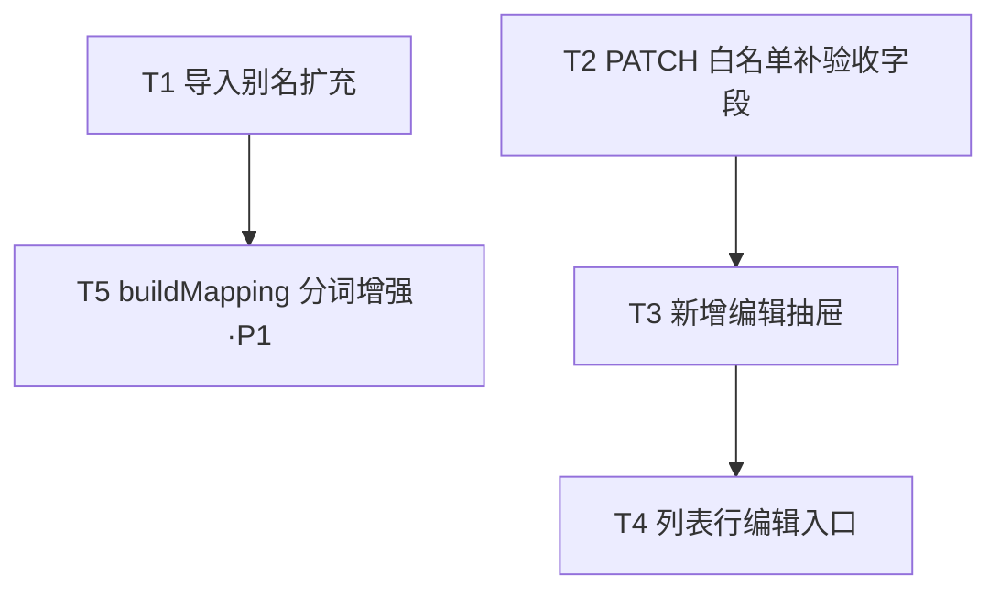

# 安全隐患整改闭环系统 · 增量设计文档（导入字段匹配 + 管理员编辑）

> 文档性质：增量开发设计（在既有系统上做最小变更，不重写既有模块）
> 角色：架构师（Bob / 高见远）
> 语言：中文
> 配套图：`docs/class-diagram.mermaid`、`docs/sequence-diagram.mermaid`

---

## 一、实现方案 + 框架选型

### 1.1 技术挑战与决策

| 难点 | 结论 |
|------|------|
| 导入表头千变万化（"场所""井场/位置""检查地点"…）需自动归一到规范字段 | **复用既有 `buildMapping`**（子串最长优先 + 编辑距离兜底），仅扩充别名表 + 可选地增强分词，**不重写匹配引擎** |
| 管理员可改任意隐患、安全员仅本人 | **复用既有 `PATCH /:id` + `requireAdminOrSafety` 鉴权 + safety 仅本人 403**（hazardLoop.js 746–748），仅把验收字段补进白名单 |
| 编辑表单不能动 `status`/`rectify_status` | PATCH 白名单**维持排除**这两者（状态流转由 assign/rectify/verify 独立接口负责） |

### 1.2 框架与依赖

- **沿用现有栈**：前端 Vue3 + Vite + 组合式 API；后端 Node + Express + MySQL（`mysql2` pool）。
- **无新依赖**：本次增量不引入任何第三方包（见第六节）。
- **架构模式**：保持现状——Service 纯解析/落库，Router 仅做薄 HTTP 层；前端列表页 + 抽屉组件。

---

## 二、变更文件列表（相对路径 + 改动性质）

| 文件 | 改动性质 | 说明 |
|------|----------|------|
| `backend/src/services/importService.js` | **改** | ①`IMPORT_FIELDS` 扩充 `location`/`plan_finish_time` 别名（T1）；②（P1 可选）`buildMapping` 复合表头分词增强（T5） |
| `backend/src/routes/hazardLoop.js` | **改** | `PATCH /:id` 的 `FIELD_MAP` 补 `is_reject_item`、`deduct_score`（含 coerce），沿用既有鉴权（T2） |
| `frontend/src/views/admin/HazardLoopPage.vue` | **改** | 列表行操作区新增「编辑」按钮，打开编辑抽屉并接 `updated` 事件刷新（T4） |
| `frontend/src/views/admin/components/HazardEditDrawer.vue` | **新增** | 编辑抽屉，复制 `HazardDetailDrawer.vue` 的 scoped 样式与表单结构（T3） |
| `frontend/src/api/hazard.js` | **确认（不改）** | `updateHazard(id, payload)`（:49）、`getHazardDetail(id)`（:39）**已存在**，本增量直接复用，无需新增封装 |

> 注：PRD 中写的 `frontend/src/views/admin/HazardDetailDrawer.vue` 路径与实际不符——实际文件在 `frontend/src/views/admin/components/HazardDetailDrawer.vue`。新增编辑抽屉建议放在同一 `components/` 目录（见第五节复用说明）。

---

## 三、数据结构与接口

### 3.1 PATCH `/api/hazards/:id` 请求体字段（白名单 + coerce 规则）

> 仅更新基础字段；`status`/`rectify_status` **不在白名单内**（决策 1）。所有字段可选，仅传哪些更新哪些。鉴权：`requireAdminOrSafety`；safety 仅可改本人录入隐患（越权 403，沿用 746–748，决策 2）。仅更新 `updated_at`，不建审计表（决策 3）。

| 字段 | 类型 | coerce 规则 | 备注 |
|------|------|-------------|------|
| `hazard_investigation_item` | string | `String(v).trim()` | 隐患排查项目 |
| `contractor_unit_id` | int\|null | `v==null/''?null:Number(v)`；NaN→400 | 责任单位 FK（可选） |
| `unit_name` | string | `String(v).trim()` | 责任单位名称 |
| `location` | string | `String(v).trim()` | 场所/位置 |
| `business_dept` | string | `String(v).trim()` | 业务归口部门 |
| `business_dept_head` | string | `String(v).trim()` | 业务部门负责人 |
| `description` | string | `String(v).trim()` | 问题描述 |
| `hazard_level` | string | `String(v).trim()` + 必须在 `LEVELS` 内，否则 400 | 重大/较大/一般隐患 |
| `rectify_measures` | string | `String(v).trim()` | 整改措施 |
| `remark` | string | `String(v).trim()` | 备注 |
| `responsible_person` | string | `String(v).trim()` | 整改责任人 |
| `plan_finish_time` | string | `String(v).trim()`，格式 `YYYY-MM-DD HH:mm:ss` | 计划完成时间 |
| `is_reject_item` | 0/1 | **`Number(v)?1:0`**（与 verify 接口一致：hazardLoop.js:874） | **本次新增进白名单**（决策 2） |
| `deduct_score` | string | `String(v??'').trim()` 原值透传（与 verify 接口一致：hazardLoop.js:878） | **本次新增进白名单**（决策 2） |

> `is_reject_item` 的归一式与验收接口完全对齐：前端 select 否/是 → 0/1；后端 `Number(v)?1:0`（"是" 经前端已转 0/1，后端再兜底）。`deduct_score` 透传字符串（可空）。

### 3.2 前端编辑表单字段清单（HazardEditDrawer）

编辑表单**不含** `status` / `rectify_status`。暴露字段（与白名单一一对应）：

- 隐患排查项目 `hazard_investigation_item`（text）
- 责任单位 `unit_name`（text）+ 可选 `contractor_unit_id`（select，来自 `getContractorUnits`）
- 业务归口 `business_dept`（text）
- 业务部门负责人 `business_dept_head`（text）
- 场所 `location`（text）
- 隐患等级 `hazard_level`（select：重大隐患/较大隐患/一般隐患）
- 整改责任人 `responsible_person`（text）
- 计划完成 `plan_finish_time`（`datetime-local`，提交前经 `toSql` 转 `YYYY-MM-DD HH:mm:ss`）
- 问题描述 `description`（textarea）
- 整改情况 `rectify_measures`（textarea）
- 备注 `remark`（text）
- 是否否决项 `is_reject_item`（select 否/是 → 0/1）
- 扣分项 `deduct_score`（text/number，可空）

### 3.3 类图（Mermaid，见 `docs/class-diagram.mermaid`）

核心实体：`ImportService`（别名表 + buildMapping）、`HazardLoopRoute`（PATCH 处理 + FIELD_MAP）、`HazardApi`（前端封装）、`HazardLoopPage`（列表 + 编辑入口）、`HazardEditDrawer`（编辑表单）、`HazardDetailDrawer`（样式来源，参考）、`HazardRecord`/`HazardEditPayload`（数据结构）。

---

## 四、程序调用流程（时序图，Mermaid，见 `docs/sequence-diagram.mermaid`）

主流程：用户点「编辑」→ 打开 `HazardEditDrawer`（先 `getHazardDetail` 预填全量字段）→ 修改后提交 `updateHazard`(PATCH) → 后端 FIELD_MAP 校验 + coerce + 鉴权 + 更新 `updated_at` → 返回更新记录 → 前端 toast + `emit('updated')` → 列表刷新。

---

## 五、HazardEditDrawer 与 HazardDetailDrawer 的复用关系（T3/T4 必读）

`HazardDetailDrawer.vue` 的样式为 `<style scoped>`，**不会跨组件继承**。因此 `HazardEditDrawer.vue` 需**复制**其 scoped 样式块，并复用其表单标记模式。

### 5.1 直接复用的样式 class（从 `HazardDetailDrawer.vue` 复制 `<style scoped>` 块）

| class | 用途 | 来源行 |
|-------|------|--------|
| `.drawer-overlay` `.drawer` | 抽屉遮罩 + 容器（右侧滑入） | 355–367 |
| `@keyframes drawer-in` / `drawer-out` | 滑入/滑出动画 | 368–370 |
| `.drawer-head` `.dh-left` `.code` `.drawer-close` | 头部：编号 + 状态徽章 + 关闭按钮 | 372–383 |
| `.drawer-body` `.sec` `.sec-title` | 主体滚动区 + 分节 | 385–388 |
| `.info-grid` `.info-item` `.k` `.v` `.info-line` | 基础信息网格/键值展示 | 389–395 |
| `.form-group` `label` `.form-input` | **表单字段结构（编辑表单直接套用）** | 406–407 |
| `.action-form` `.modal-actions` | 提交区布局 | 402/406 |
| `.btn` `.btn-primary` `.btn-outline` `.btn-success` `.btn-danger` | 按钮样式 | 贯穿 |
| `.feedback` `.feedback.error` `.feedback.success` | 提交反馈条 | 409–411 |
| `.actions-sec` `.closed-tip` | 操作区分隔 | 402/405 |

### 5.2 直接复用的逻辑/结构

- **头部展示**：复制 `drawer-head` 内 `code` + `statusBadge(current.status)` + 超期徽章 + 关闭按钮（HazardDetailDrawer 6–13 行）。
- **表单标记模式**：直接复用 `form-group > label + form-input` 结构（见 HazardDetailDrawer 分派/整改/验收表单 96–138 行）——编辑表单每个字段套用此结构即可。
- **`toSql` / `toLocalInput` 工具函数**（HazardDetailDrawer 220–226 行）：`datetime-local` ↔ `YYYY-MM-DD HH:mm:ss` 互转，编辑表单 `plan_finish_time` 直接复用。
- **徽章工具**：`statusBadge` / `levelBadge` / `statusLabel`（来自 `@/utils/hazardStatus`），编辑抽屉头部复用。
- **`getContractorUnits`**：责任单位下拉复用既有单位列表接口。

### 5.3 与详情抽屉的差异

- 详情抽屉 `current` 直接吃 `props.hazard`；编辑抽屉**额外调用 `getHazardDetail(id)` 预填**（确保 `remark`/`is_reject_item`/`deduct_score` 等字段齐全，详见时序图步骤 3–8）。
- 编辑抽屉把"流转操作"区替换为"编辑表单"区（基础字段可编辑）。
- 编辑抽屉提交走 `updateHazard`（PATCH），成功 `emit('updated')`；详情抽屉的流转走 assign/rectify/verify。

> 可选优化（非必需）：若后续多个抽屉共用，可把上述 `.drawer*` 样式抽到全局 CSS；本期为最小变更，采用"复制 scoped 块"方式，风险最低。

---

## 六、依赖包列表

**无新增依赖。** 本次增量仅修改既有源码，不引入任何第三方包（前后端均确认）。

---

## 七、任务列表（有序、含依赖）

> 说明：PRD 示例列了 T1–T6（6 个）。本增量遵循"任务数 ≤ 5 的硬上限"，将 PRD 的 T2（buildMapping 分词）+ T6（预览 notes 透出）合并为 **T5（P1 可选）**；其余一一对应。因是**增量改动**（就地改既有模块），任务与变更文件天然 1:1，不人为堆叠文件凑数。

| Task | 名称 | 源文件 | 依赖 | 优先级 |
|------|------|--------|------|--------|
| **T1** | 后端·导入字段别名扩充（IMPORT_FIELDS） | `backend/src/services/importService.js` | 无 | P0 |
| **T2** | 后端·PATCH 白名单补验收字段（含 coerce） | `backend/src/routes/hazardLoop.js` | 无 | P0 |
| **T3** | 前端·新增 HazardEditDrawer + 确认 api 封装 | `frontend/src/views/admin/components/HazardEditDrawer.vue`、`frontend/src/api/hazard.js`（确认不改） | T2 | P0 |
| **T4** | 前端·列表行加「编辑」入口并接抽屉 | `frontend/src/views/admin/HazardLoopPage.vue` | T3 | P0 |
| **T5** | 后端（P1 可选）·buildMapping 复合表头分词增强 + 导入预览回显 notes | `backend/src/services/importService.js` | T1 | P1 |

**任务依赖图（Mermaid）：**



### T1 详细（importService.js · IMPORT_FIELDS 扩充）

`location` 数组追加别名：`井场`、`检查地点`、`检查位置`、`施工位置`、`井场位置`、`检查点位`。
`plan_finish_time` 数组追加别名：`计划完成`、`计划完工`、`完工期限`、`完工时间`、`计划完工时间`。

> 校验结论：现有别名（`地点`/`位置`/`点位` 覆盖多数 location 变体；`计划完成时间`/`整改期限`/`完成时间` 覆盖多数 plan_finish_time 变体）已能子串命中 PRD 所列大部分变体；**真正新增必要**的主要是裸 `井场` 与 `计划完工`，其余为防御性补充。全部按 PRD 追加，**不会引发误匹配**（均为子串命中，且 `buildMapping` 最长优先）。**严禁**向 `INSERT_SQL` 或 `IMPORT_FIELDS` 加入 `responsible_phone`（见第八节）。

### T2 详细（hazardLoop.js · FIELD_MAP 补验收字段）

在 `FIELD_MAP`（697–709）中追加两项，沿用 verify 接口 coerce：

```js
is_reject_item: { type: 'bool-int' },   // coerce: Number(v) ? 1 : 0
deduct_score:   { type: 'string', trim: true }, // coerce: String(v ?? '').trim()
```

`PATCH` 主循环（712–729）对 `bool-int` 类型执行 `Number(val)?1:0` 后入参。鉴权与越权 403（746–748）**原样复用**，不加 admin-only 约束（决策 2）。`updated_at = NOW()` 已存在（750），不建审计（决策 3）。

### T3 详细（HazardEditDrawer.vue 新增 + api 确认）

- 新建 `frontend/src/views/admin/components/HazardEditDrawer.vue`，复制第五节列出的 scoped 样式与 `form-group` 结构。
- `onMounted`/`watch(props.hazard)` 时调 `getHazardDetail(id)` 预填；`is_reject_item` 用 0/1 绑定 select，`plan_finish_time` 用 `toLocalInput` 转 `datetime-local`。
- 提交：`updateHazard(id, payload)`（PATCH），payload 仅含用户改动的白名单字段。
- `api/hazard.js` 中 `updateHazard` / `getHazardDetail` **已存在**，本任务仅确认签名一致，**不改文件**。

### T4 详细（HazardLoopPage.vue 列表行编辑入口）

- 在第 129 行「查看」按钮旁新增「编辑」按钮：`@click.stop="openEdit(h)"`。
- `openEdit(h)` 打开 `HazardEditDrawer`（`v-model:show` + `:hazard-id="h.id"`），并 `import HazardEditDrawer`。
- 监听抽屉 `@updated` → 调 `getHazards(...)` 或就地更新该行，刷新列表。

### T5 详细（P1 可选 · buildMapping 分词增强）

在 `buildMapping` 第一遍匹配前，对表头单元格按分隔符（`/` `、` ` ` `-` `·`）拆分 token，逐 token 走既有子串匹配；命中的 token 归并到对应字段（最长优先）。同时在 `previewImport` 返回中透出 `buildMapping` 已生成的 `notes`（智能识别备注），供导入预览页 warnings 通道展示。属健壮性提升，非阻塞。

---

## 八、`responsible_phone` 残留核查（强制项）

**grep 结论：importService.js 中仍有 `responsible_phone` 残留引用，但均为"识别 + 预览展示"，无写库引用。**

| 位置 | 内容 | 性质 |
|------|------|------|
| `importService.js:35` | `IMPORT_FIELDS` 中 `responsible_phone` 别名定义（责任人电话/联系电话/手机…） | 识别用（buildMapping 候选） |
| `importService.js:53` | `FIELD_LABELS.responsible_phone` | 预览告警展示用 |
| `importService.js:172` | 注释 | — |
| `importService.js:422` | `getVal('responsible_phone')` 读取列值 | 行解析（读） |
| `importService.js:475` | `rec.responsible_phone = phone` | 行级对象赋值（不落库） |
| `importService.js:634` | `rows[].data.responsible_phone` 预览回显 | **预览展示，非写库** |
| `importService.js:742–748` | `INSERT_SQL` | **未含 responsible_phone 列** ✅ 无写库 |

**风险判定**：`INSERT_SQL` 已无该列，`commitImport` 不会写入 `responsible_phone` → **无写库风险**。导入仅把电话作为预览信息展示（且该列在线上表实际仍物理存在，见下）。

**本次是否清理**：**不清理**。理由——① PRD 约束"严禁重新引入 responsible_phone"，本增量仅"不新增写引用"即满足，且 T1 扩充别名时**不会**加入 `responsible_phone`；② 现有残留为预览展示用途，按团队指南"落库 SQL 已无该列且 preview 仅展示 → 不改"；③ 保持最小变更。

**额外提醒（与 PRD 表述略有出入，供主理人知悉）**：
- `server.js:152` 的 `CREATE TABLE` 中 `responsible_phone VARCHAR(20) DEFAULT ''` **列仍物理存在**；`backupService.js`（:28/:105/:137）仍对该列做备份写。
- 因此"线上表已无此列"不完全准确——列在库里还在，只是**导入落库不写它**。本期不动备份与建表，仅确认导入路径无写引用即可。

---

## 九、共享知识（跨文件约定）

- **`is_reject_item` 归一式**：前端 select 否/是 → 0/1；后端 coerce `Number(v)?1:0`。前后端一致。
- **`plan_finish_time` 格式**：前后端统一 `YYYY-MM-DD HH:mm:ss`；前端 `datetime-local` 经 `toSql`/`toLocalInput` 互转。
- **编辑表单不含 `status` / `rectify_status`**：状态流转一律走 assign/rectify/verify 独立接口。
- **鉴权约定**：`PATCH /:id` 用 `requireAdminOrSafety`；safety 仅可改本人（`recorder_id === req.admin.id`），否则 403；admin 可改全部白名单字段（含验收字段），后端不加 admin-only 约束。
- **无审计**：PATCH 仅更新 `updated_at`，不建审计表、不加写入逻辑。
- **`responsible_phone`**：导入仅预览展示、不落库；本增量任何文件均不新增该列写引用。

---

## 十、待明确事项（与 PRD 现状核对）

1. **路径偏差（已处理）**：PRD 写 `frontend/src/views/admin/HazardDetailDrawer.vue`，实际在 `components/HazardDetailDrawer.vue`。新增 `HazardEditDrawer.vue` 放 `components/` 下。
2. **`responsible_phone` 表述偏差（已处理）**："线上表已无此列"不准确——`server.js:152` 仍定义该列、`backupService` 仍写；但**导入落库路径确无写引用**，本增量按要求不清理、不新增。
3. **buildMapping 现状核实**：行号 257–318 准确；`IMPORT_FIELDS` 28–43 准确；`hazardLoop.js` PATCH 692–764 准确。
4. **T2 必要性提示**：经验证，PRD 所列 location/plan_finish_time 变体多数已被现有别名子串命中，T1 扩充别名即可覆盖；T2（原 buildMapping 分词）降为 P1 可选增强（T5），不影响主流程。
5. **`remark` 备注**：`FIELD_MAP` 已含 `remark`，但 `HAZARD_COLUMNS`（hazardLoop.js:66–71）未列 `remark`——PATCH 可写但 GET 默认不返回该列（列表页直接展示 `h.remark` 说明列表查询另有 select）。编辑抽屉预填 `remark` 依赖 `getHazardDetail` 是否返回该列；若详情接口也未返回，需 T2 顺带把 `remark` 加入 `HAZARD_COLUMNS`（建议一并补，成本低）。**建议 T2 同时确认 `HAZARD_COLUMNS` 含 `remark`**，否则编辑表单的备注无法回显。
6. **导入预览 notes 透出（T5）**：`buildMapping` 已生成 `notes` 数组，但 `previewImport` 当前返回未携带 `notes`（`importService.js:678–688` 仅回传 mapping/rows/warnings）。T5 需在 `previewImport`/`parseWorkbook` 返回里带上 `notes`，前端导入预览页才能展示"智能识别备注"。
