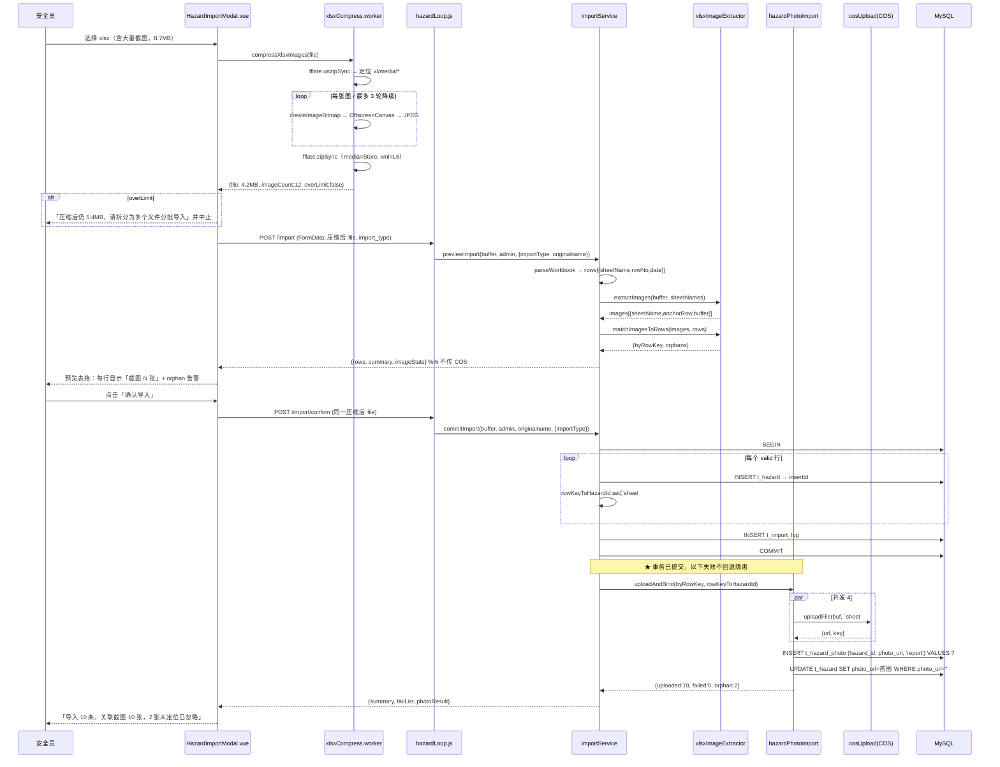
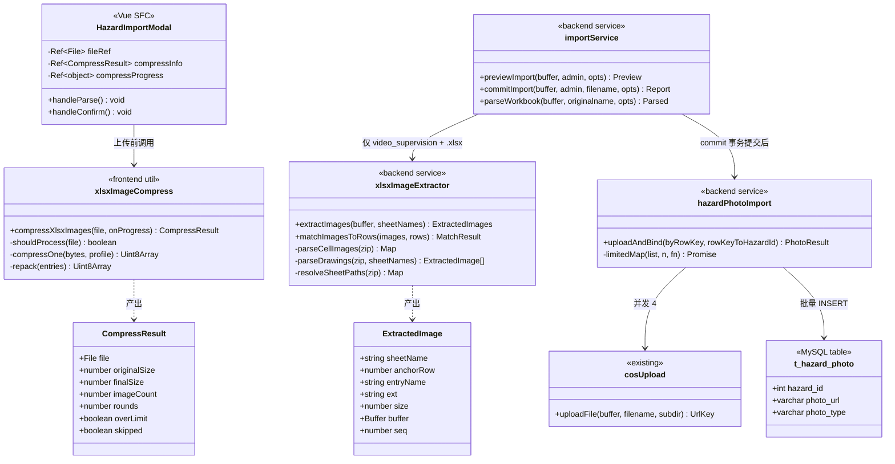

# 视频督查导入：前端 xlsx 压缩 + 后端内嵌截图入库 —— 架构设计与任务分解

> 架构师：高见远（software-architect）
> 基线代码：`backend/src/services/importService.js` (893行) / `routes/hazardLoop.js` / `services/cosUpload.js` / `frontend/.../HazardImportModal.vue`
> 所有结论均基于实际 Read 代码，偏离点见 §0。

---

## 0. 与任务书描述不符的偏离点（重要，工程师必读）

| # | 任务书描述 | 实际代码 | 影响 |
|---|-----------|---------|------|
| D1 | `t_hazard_photo(hazard_id, url, ...)` | 实际字段为 `(id, hazard_id, photo_url, photo_type, created_at)`，`photo_type` 取 `'report'`/`'rectify'`（`server.js:268`） | 落库 SQL 用 `photo_url`，本功能固定 `photo_type='report'` |
| D2 | `cosUpload.uploadFile(buffer, key)` | 实际签名 `uploadFile(buffer, filename, subdir='materials') → {url, key}`，**key 由内部 `${subdir}/${ts}_${rand}${ext}` 生成，不可自定义** | "图片 key 命名规则"只能通过 `subdir` + `filename` 扩展名控制；**不改 cosUpload** |
| D3 | confirm 落库后关联 hazard_id | `commitImport` 当前**只 `inserted++`，完全不记录 `insertId`**；且 `validRows = parsed.rows.filter(...).map(r => r.data)` **已丢弃 `sheetName`/`rowNo`** | 这是本功能最核心的改造点：必须保留行标识并回收 `insertId` |
| D4 | 后端需装 jszip/unzipper | `adm-zip` + `xml2js` **已是现有依赖**（`docParser.js` 在用，node_modules 已验证可 require） | **后端零新增依赖** |
| D5 | 普通导入 `importType===''` | 前端默认值是 `'ledger'`（`HazardImportModal.vue:214`），`''` 只是 prop 缺省 | 判断条件一律用 `=== 'video_supervision'` 白名单，不要用 `!== ''` |
| D6 | 只处理 xlsx | multer fileFilter 同时放行 `.xls` / `.csv`（`hazardLoop.js:194`） | `.xls`（BIFF）与 `.csv` 无 zip 结构，压缩与提取必须**跳过**，否则解包报错 |
| D7 | — | `previewImport(buffer, admin, opts)` 调 `parseWorkbook(buffer, '', opts)`，**originalname 被硬编码为 `''`** | 需把 `req.file.originalname` 透传下去才能判扩展名 |

**红线确认**：`hazardLoop.js:193` 的 `limits.fileSize: 5*1024*1024` **不改**。

---

## 1. 实现方案概述与选型

### 1.1 核心难点
1. **xlsx 是 zip**：整体再压缩无效，必须「解包 → 只压 `xl/media/*` → 原样重打包」。
2. **图片→行的锚点定位**：这是成败关键。国内视频督查表格存在两种截然不同的嵌图方式，必须**双路径都支持**。
3. **落库时序**：COS 上传（网络 IO，可能数十秒）绝不能放在 MySQL 事务里。

### 1.2 选型

**前端**
- **zip 解包/重打包：`fflate`（^0.8.2）** —— 唯一新增依赖。~8KB gzip，纯 JS 无 wasm，`unzipSync`/`zipSync` API 极简。相比 `jszip`（~100KB）体积小一个量级，速度快 3-5 倍。
- **图片压缩：浏览器原生 `createImageBitmap` + `OffscreenCanvas.convertToBlob()`（降级 `<canvas>.toBlob()`）** —— **不引入 `browser-image-compression`**。理由：内嵌截图来自 Excel 内部，无 EXIF 方向问题（`browser-image-compression` 的主要价值就是 EXIF + worker），原生 API 已足够，少一个 60KB 依赖。
- 大文件卡顿：整个压缩流程放进 **Web Worker**（`fflate` 与 `createImageBitmap`/`OffscreenCanvas` 均可在 worker 中运行），主线程只收进度。

**后端**
- **`adm-zip`（已有）** 读 zip 条目 —— 与 `docParser.js` 完全同构（它读 `word/media/`，我们读 `xl/media/`），团队已有心智模型。
- **`xml2js`（已有）** 解析 `xl/drawings/drawingN.xml`、`xl/cellimages.xml`、各 `.rels`。
- **不引入 `sharp`** —— 原生编译在 CVM 上易翻车；且图片已被前端压过一轮，后端只做**尺寸兜底校验**（超过 `MAX_PHOTO_BYTES` 则跳过并告警），不做二次压缩。

### 1.3 架构模式
Service 层纯函数化（与现有 `importService` 风格一致）：`xlsxImageExtractor` 只做「buffer → 结构化图片清单」的纯解析（零 IO、可单测）；`hazardPhotoImport` 做 COS + 落库编排；Router 保持薄。

---

## 2. 文件列表

### 新增
```
backend/src/services/xlsxImageExtractor.js          # 纯解析：xlsx buffer → 带行锚点的图片清单
backend/src/services/hazardPhotoImport.js           # 编排：压缩校验 → COS → t_hazard_photo
backend/src/services/__tests__/xlsxImageExtractor.test.js
frontend/src/constants/importCompress.js            # 压缩参数常量（唯一真源）
frontend/src/utils/xlsxImageCompress.js             # 解包 → 压图 → 重打包（主线程 API）
frontend/src/workers/xlsxCompress.worker.js         # Worker 实现体
```

### 修改
```
backend/src/services/importService.js               # parseWorkbook 产出 imageStats；commitImport 回收 insertId + 调编排
backend/src/routes/hazardLoop.js                    # 仅透传 req.file.originalname 给 previewImport（1 行）
frontend/src/views/admin/components/HazardImportModal.vue  # 压缩前置 + 进度 + 超限提示 + 预览「截图」列
```
`frontend/src/api/hazard.js` **无需修改**（`fd.append('file', file)` 接收 File/Blob，压缩后构造的 `new File([blob], 原名)` 可直接传）。

---

## 3. 数据结构与接口

### 3.1 前端

```js
// frontend/src/constants/importCompress.js
export const COMPRESS_PROFILES = [
  { maxEdge: 1600, quality: 0.72 },   // 第 1 轮
  { maxEdge: 1280, quality: 0.60 },   // 第 2 轮（第 1 轮后仍超限）
  { maxEdge: 1024, quality: 0.50 },   // 第 3 轮（最后一搏）
]
export const TARGET_BYTES   = 4.6 * 1024 * 1024  // 留 0.4MB 给 multipart 边界开销
export const HARD_LIMIT     = 5   * 1024 * 1024  // 后端 multer 红线
export const MIN_IMAGE_BYTES= 80  * 1024         // 小于此值的图不压（图标/签章）
export const MEDIA_PREFIX   = 'xl/media/'
```

```js
// frontend/src/utils/xlsxImageCompress.js
/**
 * @param {File} file 用户选择的原始 xlsx
 * @param {(p:{phase:'unzip'|'compress'|'zip', done:number, total:number})=>void} onProgress
 * @returns {Promise<CompressResult>}
 */
export async function compressXlsxImages(file, onProgress)

/** @typedef {{
 *   file: File,            // 压缩后的新 File（同名，可直接上传）
 *   originalSize: number,
 *   finalSize: number,
 *   imageCount: number,
 *   compressedCount: number,
 *   rounds: number,        // 实际迭代轮数
 *   overLimit: boolean,    // true = 压完仍 > HARD_LIMIT
 *   skipped: boolean       // true = 非 .xlsx 或无内嵌图，原文件直出
 * }} CompressResult */
```

**关键实现约定**
- 只重写 `xl/media/` 下的条目，**其余条目字节级原样写回**。
- **扩展名保持不变**（JPEG 字节写回 `image1.png`）。Excel / WPS / LibreOffice 均按 magic bytes 嗅探，实测可渲染 —— 但**必须在 T02 用真实文件实机验证**。若验证失败，走备选：改名为 `.jpeg` + 在 `[Content_Types].xml` 补 `<Default Extension="jpeg" ContentType="image/jpeg"/>` + 字符串替换 `xl/drawings/_rels/*.rels`（及 `xl/_rels/cellimages.xml.rels`）中的 `Target`。
- 重打包时 media 条目用 **level 0（Store）**（JPEG 已压缩，deflate 徒增 CPU 无收益），XML 条目用 level 6。
- 保留原始 `file.name` 与 `lastModified`。

### 3.2 后端提取服务

```js
// backend/src/services/xlsxImageExtractor.js

/**
 * 从 xlsx buffer 提取内嵌图片并解析其所属 Excel 行（纯函数，零 IO）
 * @param {Buffer} buffer
 * @param {string[]} sheetNames  来自 wb.SheetNames，用于对齐 sheet 顺序
 * @returns {ExtractedImages}
 */
function extractImages(buffer, sheetNames)

/** @typedef {{
 *   images: ExtractedImage[],
 *   anchorMode: 'cellimage' | 'drawing' | 'mixed' | 'none',
 *   warnings: string[]
 * }} ExtractedImages */

/** @typedef {{
 *   sheetName: string,
 *   anchorRow: number|null,   // Excel 1-based 行号，与 importService 的 rowNo 同基准；null = 无锚点
 *   entryName: string,        // 'xl/media/image3.png'
 *   ext: string,              // '.png'
 *   size: number,
 *   buffer: Buffer,
 *   seq: number               // 同一行内的顺序（按 anchorRow, anchorCol 排序后赋值）
 * }} ExtractedImage */

/**
 * 把图片按「向上就近」规则归属到已解析的数据行
 * @param {ExtractedImage[]} images
 * @param {{sheetName:string,rowNo:number,index:number}[]} rows  parseWorkbook 产出的行
 * @returns {{ byRowKey: Map<string, ExtractedImage[]>, orphans: ExtractedImage[] }}
 */
function matchImagesToRows(images, rows)
```

**锚点解析双路径**（`extractImages` 内部，优先级 B > A）：

- **Path B — WPS「嵌入单元格图片」（DISPIMG）**：存在 `xl/cellimages.xml` 时启用。
  `xl/cellimages.xml` 内每个 `<etc:cellImage>` 的 `<xdr:cNvPr name="ID_xxxx">` + `<a:blip r:embed="rIdN">`，经 `xl/_rels/cellimages.xml.rels` 映射到 `xl/media/*`；再扫描各 `xl/worksheets/sheetN.xml` 中形如 `<f>_xlfn.DISPIMG("ID_xxxx",1)</f>` 的单元格，从其 `r="C12"` 属性直接得到**精确行号 12**。
  → 这是**准确率最高**的路径，国内 WPS 制表极常见，必须优先支持。

- **Path A — Excel 标准浮动图片（drawing anchor）**：
  `xl/workbook.xml` 的 `<sheets>` 顺序 ↔ `wb.SheetNames` 顺序，经 `xl/_rels/workbook.xml.rels` 得 sheet 文件真实路径（**不可假设 `sheet1.xml` 就是第 1 个 sheet**）→ `xl/worksheets/_rels/sheetN.xml.rels` 找 `Type=".../drawing"` 的 Target → `xl/drawings/drawingN.xml` 遍历 `<xdr:twoCellAnchor>` / `<xdr:oneCellAnchor>`，取 `<xdr:from><xdr:row>R</xdr:row><xdr:col>C</xdr:col>`（**0-based**）→ `anchorRow = R + 1`；`<a:blip r:embed>` 经 `xl/drawings/_rels/drawingN.xml.rels` 映射到 media。
  `<xdr:absoluteAnchor>`（无行列）→ `anchorRow = null`。

- 两者皆无 → `anchorMode='none'`，所有图片 `anchorRow=null`。

**归属规则 `matchImagesToRows`（明确定义）**：
> 对某 sheet 内按 `rowNo` 升序排列的数据行 `[r1, r2, ... rn]`，图片 `anchorRow = A` 归属于**满足 `rowNo <= A` 的最大 rowNo 那一行**。
> - 天然兼容**合并单元格 / 一条隐患跨多行**：图片落在合并区任意行，都会归到该隐患的主行。
> - `A < r1.rowNo`（图片在表头上方，如公司 logo）→ 进 `orphans`。
> - `anchorRow === null` → 进 `orphans`。
> - **orphans 一律不落库，仅在 warnings 中提示**（如「3 张图片未能定位到隐患行，已忽略」）。不做「全挂首行」——会污染数据，宁缺毋滥。
> - 单行超过 `MAX_PHOTO_PER_ROW = 6` 张 → 按 `seq` 截断，超出部分告警。

### 3.3 落库编排

```js
// backend/src/services/hazardPhotoImport.js
/**
 * 事务提交「之后」调用：图片 → COS → t_hazard_photo，失败不影响已导入隐患
 * @param {Map<string, ExtractedImage[]>} byRowKey   rowKey = `${sheetName}#${rowNo}`
 * @param {Map<string, number>} rowKeyToHazardId     commitImport 事务内回收
 * @returns {Promise<{uploaded:number, failed:number, orphan:number, warnings:string[]}>}
 */
async function uploadAndBind(byRowKey, rowKeyToHazardId)
```
内部：并发度 **4**（`p-limit` 手写 8 行，不引依赖）→ `cosUpload.uploadFile(img.buffer, `${rowKey}_${img.seq}${img.ext}`, 'hazards/import')` → 批量
`INSERT INTO t_hazard_photo (hazard_id, photo_url, photo_type) VALUES ?`（`photo_type='report'`）
→ 回填主表首图 `UPDATE t_hazard SET photo_url=? WHERE id=? AND (photo_url IS NULL OR photo_url='')`（与 `hazard.js:70-74` 现有语义一致）。

### 3.4 两阶段职责划分（关键决策）

| 阶段 | 是否提取图片 | 是否传 COS | 产出 |
|-----|------------|-----------|------|
| `/api/hazards/import`（预览） | ✅ 解析锚点（纯内存，快） | ❌ **不传** | `imageStats` 塞进返回体 |
| `/api/hazards/import/confirm` | ✅ | ✅ 事务**提交后**上传 | `photoResult` 塞进返回体 |

预览阶段仍解析锚点（而非只数个数），是为了能在预览表格里**逐行显示"本行 N 张截图"**，让安全员确认匹配是否正确 —— 这比只给一个总数有用得多，且成本几乎为零（纯内存 XML 解析）。

```js
// previewImport 返回体新增
imageStats: {
  total: 12, matched: 10, orphan: 2,
  anchorMode: 'cellimage',
  perRow: { '视频督查#5': 2, '视频督查#6': 3 }   // rowKey → 张数
}
// commitImport 返回体新增
photoResult: { uploaded: 10, failed: 0, orphan: 2, warnings: [...] }
```

### 3.5 `commitImport` 改造要点（D3）

```js
// 改造前：const validRows = parsed.rows.filter(r => r.status==='valid').map(r => r.data)
// 改造后：保留行标识
const validRows = parsed.rows.filter(r => r.status === 'valid')   // 保留完整对象
...
for (const r of validRows) {
  const rec = r.data
  const [ins] = await conn.execute(INSERT_SQL, [...])
  rowKeyToHazardId.set(`${r.sheetName}#${r.rowNo}`, ins.insertId)  // ★ 回收 insertId
  inserted++
}
await conn.commit()
// ★ 事务外：COS + 照片落库；try/catch 包裹，失败只告警不抛
```

**一致性策略（明确）**：隐患数据强一致（事务），照片弱一致（最终一致/尽力而为）。COS 或照片落库失败 **不回退隐患** —— 隐患成功导入是主价值，照片可后续用 `POST /api/hazard/photo/upload` 手工补。此决策需在 §8 向用户确认。

---

## 4. 程序调用流程

### 4.1 时序图



### 4.2 类图



---

## 5. 任务列表（有序，5 个）

### T01 — 前端压缩内核 + 参数常量　`P0`　依赖：无
- **文件**：`frontend/src/constants/importCompress.js`（新）、`frontend/src/utils/xlsxImageCompress.js`（新）、`frontend/src/workers/xlsxCompress.worker.js`（新）、`frontend/package.json`（加 `fflate`）
- **要点**：`fflate` 解包 → 过滤 `xl/media/*` → `createImageBitmap`+`OffscreenCanvas` 逐张压 → 未达 `TARGET_BYTES` 则按 `COMPRESS_PROFILES` 逐轮降级（最多 3 轮）→ `zipSync` 重打包（media Store / xml L6）→ 返回 `CompressResult`。
- **验收**：非 `.xlsx`（`.xls`/`.csv`）或无 `xl/media/` 时 `skipped=true` 原样返回；小于 `MIN_IMAGE_BYTES` 的图跳过；输出 `overLimit` 标志。

### T02 — 前端 UI 接入 + 实机兼容性验证　`P0`　依赖：T01
- **文件**：`frontend/src/views/admin/components/HazardImportModal.vue`（改）
- **要点**：`handleParse()` / `handleConfirm()` **都要**先压缩（两次上传必须是同一份字节，否则后端两次解析结果不一致）→ 建议在 `handleParse` 压完后把结果**缓存到 `compressedFileRef`**，`handleConfirm` 直接复用，避免压两次。压缩进度条；`overLimit` 时**弹出友好提示并阻断上传**（文案：「文件含 N 张图片，压缩后仍 X MB，超过 5MB 上限，请将 Excel 拆分为多个文件分批导入」）；压缩前后大小对比展示。仅 `importType==='video_supervision'` 启用。
- **⚠ 关键验收**：用**真实视频督查 xlsx** 压缩后，在 **Excel 和 WPS 中打开确认图片正常渲染**。若渲染异常 → 切换到「改扩展名 + 补 `[Content_Types].xml` + 改 `.rels` Target」方案（见 §3.1）。

### T03 — 后端图片提取服务（纯函数 + 单测）　`P0`　依赖：无（**可与 T01/T02 并行**）
- **文件**：`backend/src/services/xlsxImageExtractor.js`（新）、`backend/src/services/__tests__/xlsxImageExtractor.test.js`（新）
- **要点**：`adm-zip` + `xml2js` 实现 Path B（cellimages/DISPIMG，优先）与 Path A（drawing anchor）；`resolveSheetPaths` 必须经 `xl/_rels/workbook.xml.rels` 解析，**不得假设 sheet 文件名顺序**；`matchImagesToRows` 实现「向上就近」归属 + orphan 池 + `MAX_PHOTO_PER_ROW` 截断。
- **验收**：零 IO 纯函数；对无图/无锚点/`.xls` buffer 均安全返回空结果不抛异常。

### T04 — 后端两阶段接入　`P0`　依赖：T03
- **文件**：`backend/src/services/importService.js`（改）、`backend/src/services/hazardPhotoImport.js`（新）、`backend/src/routes/hazardLoop.js`（改 1 行）
- **要点**：`hazardLoop.js` 把 `req.file.originalname` 透传给 `previewImport`（修 D7）；`parseWorkbook` 在 `importType==='video_supervision' && .xlsx` 时调 extractor 并产出 `imageStats`；**`commitImport` 保留完整 row 对象并回收 `insertId`**（修 D3）；事务提交后调 `uploadAndBind`，整段 try/catch 包裹，失败只写 warnings 不抛。
- **验收**：普通台账导入（`ledger`）走原路径，**行为字节级不变**（回归测试）。

### T05 — 端到端联调 + 兜底与回归　`P1`　依赖：T02、T04
- **文件**：`HazardImportModal.vue`（预览「截图」列 + `photoResult` 结果展示）、必要的联调修补
- **要点**：预览表格按 `imageStats.perRow[rowKey]` 逐行显示张数；orphan 告警展示；导入报告展示「关联截图 N 张 / 失败 M 张」；COS 未配置时的降级路径；全链路真机跑通；回归 `.xls`/`.csv`/普通导入三条旧路径。

**并行建议**：T01+T02（前端）与 T03（后端）可同时开工，T04 等 T03，T05 收口。

### 依赖图


---

## 6. 依赖包清单

**前端（新增 1 个）**
```
fflate@^0.8.2        # xlsx(zip) 解包/重打包，~8KB gzip，纯JS
```
> 不装 `browser-image-compression`（原生 canvas 已够）、不装 `jszip`（体积是 fflate 的 12 倍）。

**后端（新增 0 个）** ✅
```
adm-zip     已有（docParser.js 在用，node_modules 已验证）
xml2js      已有（同上）
cos-nodejs-sdk-v5  已有
```
> 明确**不引入 `sharp`**：原生编译在 CVM 上风险高；图片已被前端压过一轮，后端只做大小兜底校验。

---

## 7. 共享知识（跨文件约定）

1. **rowKey 统一格式**：`` `${sheetName}#${rowNo}` ``，`rowNo` 为 **Excel 1-based 绝对行号**，与 `importService.parseWorkbook` 的 `rowNo = headerIdx + i + 2` 同基准。前后端一致。
2. **行号基准换算**：drawing anchor 的 `<xdr:row>` 是 **0-based** → `anchorRow = xdrRow + 1`。DISPIMG 从单元格 `r="C12"` 取到的已是 1-based，直接用。
3. **启用条件（唯一判据）**：`importType === 'video_supervision' && /\.xlsx$/i.test(originalname)`。其余一切情况（`ledger` / `.xls` / `.csv`）走原逻辑，零行为变更。
4. **COS 约定**：`subdir = 'hazards/import'`；`filename` 传 `` `${sheetName}_${rowNo}_${seq}${ext}` ``（仅用于取扩展名 + 日志可读，真实 key 由 `cosUpload` 内部生成，**不改 cosUpload**）。
5. **`t_hazard_photo` 约定**：本功能写入的 `photo_type` 恒为 `'report'`；首图回填 `t_hazard.photo_url`，条件 `AND (photo_url IS NULL OR photo_url='')`。
6. **压缩参数唯一真源**：`frontend/src/constants/importCompress.js`，禁止在组件内散落魔法数字。
7. **一致性契约**：隐患 = 强一致（事务）；照片 = 弱一致（事务外，失败仅告警）。
8. **两次上传字节必须一致**：`/import` 与 `/import/confirm` 上传的必须是**同一个压缩后 File 对象**（前端缓存），否则两次 `parseWorkbook` 结果漂移，`rowKey` 对不上。**这是最容易踩的坑**。
9. **响应体扩展**：预览加 `imageStats`，确认加 `photoResult`，均为**可选字段**，老前端不读也不报错（向后兼容）。

---

## 8. 待明确事项

1. **【最高优先级，阻塞 T03 验收】需要用户提供 1 份真实的视频督查 Excel 样例文件**。当前无法确定截图是「Excel 浮动图片(drawing anchor)」还是「WPS 嵌入单元格图片(DISPIMG)」—— 二者解析路径完全不同。设计已双路径覆盖，但**准确率与兜底行为必须用真实文件验证**。仓库内 `docs/` 与全库均无样例 xlsx。
2. **orphan（无法定位行）图片的处置**：当前设计为「不落库，仅告警」。是否改为「挂到该 sheet 首个隐患」或「挂到一个虚拟收纳隐患」？建议保持不落库（宁缺毋滥），待用户确认。
3. **COS/照片落库失败是否需要重试入口**：当前仅告警，安全员需手工用现有 `POST /api/hazard/photo/upload` 补图。是否需要一个「重新关联截图」按钮？
4. **隐患详情页是否已渲染 `t_hazard_photo` 列表**：后端 `GET /api/hazard/photo/:hazardId` 已存在，但前端详情页是否展示多图未确认 —— 若未展示，导入的截图用户看不到，本功能价值打折，需追加任务。
5. **是否需要规范 Excel 模板**：若用户能约定「截图必须嵌入到隐患行的指定列」，匹配准确率可达 100%。否则依赖锚点推断，存在漏配可能。
6. **JPEG 字节写回 `.png` 扩展名的兼容性**：T02 需实机验证（Excel + WPS 双端）。备选方案已在 §3.1 给出。
